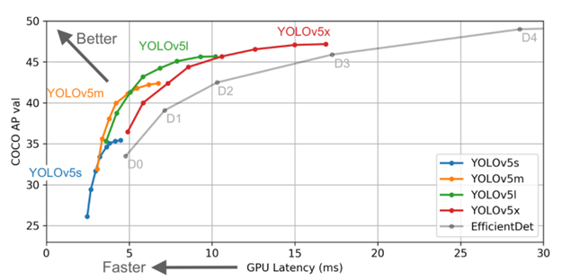

## Language / IDE

* 
* 
* 
* 
* 
* 
* 
* 

## Model

* YOLO (You Look Only Once)
  * View the entire image only once
  * Region proposal, Feature extraction, Classification, Bbox regression
  * Because it learns surrounding information and processes the entire image, less background error
  * High detection accuracy even for new images not seen in the training phase

 
 
 
 

## Dataset

* 2140 images
* 2140 xml files

  
 

## Result

* plate: 89%

  
 
 

